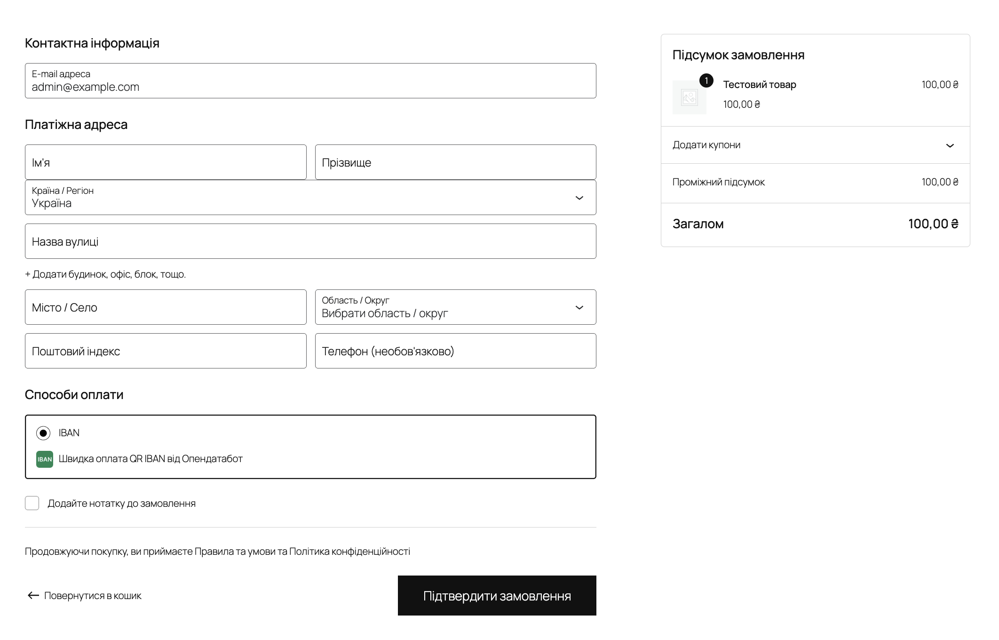

# Opendatabot IBAN Invoice для WooCommerce

Плагін оплати для WooCommerce: створює рахунок IBAN через Opendatabot і перенаправляє покупця на сторінку оплати. За бажанням — фіксує оплату автоматично через Автоклієнт Opendatabot.

**Вимоги:** WordPress 5.0+, WooCommerce 3.0–9.x, PHP 7.0+. Працює з Classic і Blocks Checkout, сумісний з HPOS. Магазин має бути у валюті **UAH**.

---

## Метод оплати в чекауті

Метод оплати **IBAN — Швидка оплата QR IBAN від Опендатабот** у блоці «Способи оплати» на сторінці оформлення замовлення:



---

## Встановлення

1. **WP admin → Плагіни → Додати новий → Завантажити плагін**, виберіть `opendatabot-iban.zip`, активуйте.
   Альтернатива: розпакуйте zip у `wp-content/plugins/` (структура `wp-content/plugins/opendatabot-iban/opendatabot-iban.php`).
2. **WooCommerce → Налаштування → Платежі → Opendatabot IBAN Invoice → Керувати** — заповніть поля (див. нижче) і збережіть.

Перед налаштуванням підготуйте: ключі API (`x-client-key`, `x-client-name`) з [iban.opendatabot.ua](https://iban.opendatabot.ua/create-invoice), IBAN (UA + 27 цифр), РНОКПП/ЄДРПОУ (8 або 10 цифр).

---

## Налаштування

| Поле                    | Опис                                                                                                       |
| ----------------------- | ---------------------------------------------------------------------------------------------------------- |
| **Увімкнено**           | Вмикає метод у чекауті.                                                                                    |
| **Назва / Опис**        | Текст, який бачить покупець у чекауті.                                                                     |
| **IBAN**                | UA + 27 цифр. Обов'язково.                                                                                 |
| **РНОКПП / ЄДРПОУ**     | 8 або 10 цифр. Обов'язково.                                                                                |
| **x-client-key / name** | Ключі API Opendatabot. Обов'язково.                                                                        |
| **Призначення платежу** | Плейсхолдер `{order_id}` підставляється номером замовлення (дописується автоматично, якщо відсутній).      |
| **Початковий статус**   | Статус при створенні замовлення (рекомендовано **Очікує оплати**).                                         |

**Автоклієнт** (опційно, потребує налаштування на iban.opendatabot.ua):

| Поле                  | Опис                                                                                                         |
| --------------------- | ------------------------------------------------------------------------------------------------------------ |
| **Автоклієнт**        | Вмикає автоматичне підтвердження оплати. Покупцю показується сторінка очікування.                            |
| **Статус (оплачено)** | Статус після успішного callback (**В обробці** / **Виконано**).                                              |
| **Callback URL**      | URL з адмінки плагіна → поле «Webhook URL» в Автоклієнті. Формат: `https://ваш-магазин/?wc-api=opendatabot_iban`. |

---

## Усунення несправностей

**Метод не видно в чекауті:** валюта не UAH, плагін вимкнено, порожні обов'язкові поля, або кеш сайту/CDN.

**Callback не фіксує оплату:** перевірте, що `Callback URL` у Автоклієнті збігається з URL з адмінки; сервер доступний публічно (не `localhost`); логи: **WooCommerce → Статус → Логи** → `opendatabot-iban`. Підпис `Signature` — HMAC-SHA256 тіла з ключем `x-client-key`.

---

## Для розробників

```
woocommerce-iban/
├── src/                              # плагін (кореневі файли для .zip)
│   ├── opendatabot-iban.php
│   ├── uninstall.php
│   ├── readme.txt
│   ├── includes/
│   ├── assets/
│   └── languages/                    # .pot, uk, ru_RU
├── scripts/build-plugin-zip.sh
└── dev/                              # Docker dev-стенд
```

**Збірка:** `./scripts/build-plugin-zip.sh` → `opendatabot-iban-<version>.zip`. Компілює `.po → .mo`, якщо є `msgfmt`.

**Dev:** покладіть вміст `src/` у `wp-content/plugins/opendatabot-iban/` (або symlink). Або підніміть Docker-стенд з `dev/` (див. [dev/README.md](dev/README.md)).

**Callback API:** `POST https://ваш-магазин/?wc-api=opendatabot_iban`, JSON body, заголовок `Signature` = HMAC-SHA256(body, x-client-key). Поле `invoiceNumber` = `order_id`.

**Filter:** `opendatabot_iban_icon` — URL іконки методу.

---

## Посилання

- [WooCommerce Payment Gateway API](https://woocommerce.com/document/payment-gateway-api/)
- [WooCommerce Blocks Payment Method Integration](https://github.com/woocommerce/woocommerce-blocks/blob/trunk/docs/third-party-developers/extensibility/checkout-payment-methods/payment-method-integration.md)
- [Opendatabot: створення рахунку IBAN](https://iban.opendatabot.ua/create-invoice)
